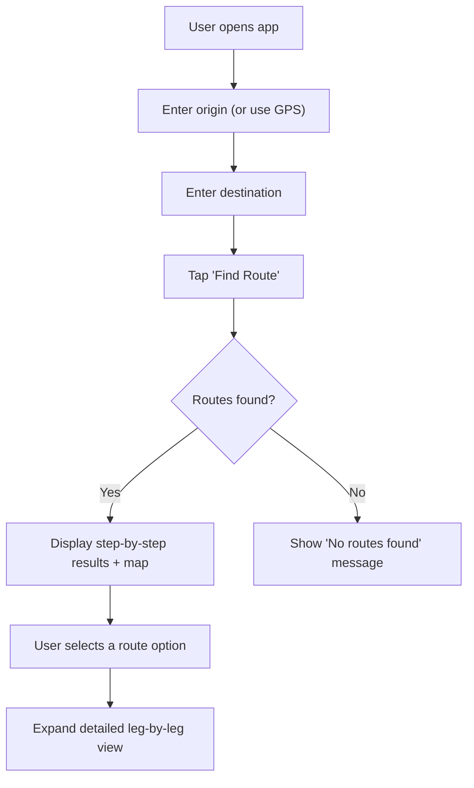

# Product Requirements Document: Transit Route Planner

## 1. Overview

A web application that lets users enter an origin and destination within **Metro Manila, Philippines**, then returns step-by-step public transit directions — including transfers, walking segments, and estimated travel times — so they can navigate from A to B using available transport options.

**Target Region:** Metro Manila, Philippines
**Transport Modes:** Bus, train (MRT/LRT), jeepney, tricycle, ferry — all available public transit
**Routing Engine:** OpenTripPlanner (self-hosted, free) with GTFS data
**User Accounts:** None — anonymous usage only

---

## 2. Problem Statement

Commuters — especially in cities with multiple transit modes (bus, train, jeepney, ferry, etc.) — struggle to piece together a complete route from origin to destination. Existing solutions (Google Maps, Moovit) may lack local coverage or overwhelm users with options. This app focuses on **clear, step-by-step transit instructions** with a clean, premium UI.

---

## 3. Target Users

| Segment | Description |
|---|---|
| **Daily commuters** | Workers/students navigating multi-leg transit routes |
| **Visitors / tourists** | Unfamiliar with local transit systems |
| **Non-drivers** | People who rely entirely on public transport |

---

## 4. Core Features

### 4.1 Route Search

- **Origin input** — text field with autocomplete (geocoding)
- **Destination input** — text field with autocomplete (geocoding)
- **"Find Route" button** — triggers route computation
- Optional: **"Use my location"** button for origin (Geolocation API)

### 4.2 Step-by-Step Results

Each result displays an ordered list of legs:

| Field | Example |
|---|---|
| **Mode icon** | 🚌 Bus / 🚆 Train / 🚶 Walk / 🚢 Ferry |
| **Line / route name** | "Bus 22", "MRT-3 Northbound" |
| **Board at** | Stop/station name + estimated departure |
| **Alight at** | Stop/station name + estimated arrival |
| **Duration** | Per-leg and total |
| **Walking segments** | Distance + time between transit stops |
| **Transfers** | Clearly marked with instructions |

### 4.3 Multiple Route Options

- Return **2–3 alternative routes** ranked by:
  1. Fastest
  2. Fewest transfers
  3. Lowest cost (if fare data available)

### 4.4 Interactive Map

- Display route on a map with colored polylines per leg
- Markers for origin, destination, and transfer points
- Pan/zoom support

### 4.5 Area Routes Explorer

A toggle panel that overlays **all transit routes by vehicle mode** on the map, so users can see what's available in any area — independent of a specific origin/destination search.

- **Mode filter toggles** — checkboxes or toggle buttons for each mode:
  - 🚌 Bus routes
  - 🚆 Train lines (MRT/LRT)
  - 🚐 Jeepney routes
  - 🛺 Tricycle zones
  - 🚢 Ferry routes
- **Colored polylines** — each mode gets a distinct color on the map
- **Click a route** → shows route name, stops, and schedule summary in a sidebar/popup
- **Stop markers** — toggle to show/hide individual stops along displayed routes
- **Legend** — color key for active modes
- Data sourced from GTFS `routes.txt` + `shapes.txt` (or stop-to-stop polylines if shapes unavailable)

### 4.6 Real-Time Vehicle Tracking

Live vehicle positions displayed on the map so users can see where buses/trains actually are — not just where the schedule says they should be.

- **Live vehicle markers** — animated icons showing real-time positions of buses, trains, ferries
- **Predicted arrival times** — "Bus 22 is 3 stops away (~7 min)" based on actual position, not schedule
- **Auto-refresh** — positions update every 15–30 seconds
- **Status indicators** — on-time (green), delayed (yellow), significantly delayed (red)
- **Data source**: GTFS-Realtime (GTFS-RT) feeds from transit agencies
  - `VehiclePositions` — lat/lng of active vehicles
  - `TripUpdates` — predicted arrival/departure times at upcoming stops
  - `ServiceAlerts` — disruptions, reroutes, cancellations

> [!NOTE]
> GTFS-RT availability in Metro Manila is limited. MRT-3 and some bus operators may have feeds. For operators without GTFS-RT, fall back to schedule-based times with a "schedule only" badge.

### 4.7 Traffic-Aware ETAs

Adjust estimated travel times based on real-world traffic conditions, especially critical for road-based transit (bus, jeepney, tricycle) in Manila's heavy congestion.

- **Time-of-day multipliers** — pre-computed rush hour factors for known corridors (e.g., EDSA 7–9AM = 1.8× base time)
- **Live traffic integration** — pull traffic data from a free source (e.g., TomTom Traffic API free tier, or OpenStreetMap traffic data) to adjust walking and road-based transit ETAs
- **Visual indicator** — show "🟢 Light traffic" / "🟡 Moderate" / "🔴 Heavy" per road-based leg
- **Walking time adjustment** — factor in pedestrian conditions (rain, heat) if weather API integrated

### 4.8 Accessibility & PWD Mode

A global toggle that switches the app into **PWD (Person with Disability) mode**, affecting routing, display, and fares.

- **PWD toggle** — prominent switch in header or settings panel
  - When ON:
    - Routes **only use wheelchair-accessible stops and vehicles**
    - Elevator/ramp availability shown at stations
    - Walking segments flagged if they involve stairs, steep grades, or unpaved paths
    - Fare calculator auto-applies PWD discount
    - Route results deprioritize long walking segments
  - When OFF:
    - Standard routing (all stops/vehicles)
- **Accessibility data per stop/station**:
  - ♿ Wheelchair accessible (yes/no)
  - 🛗 Elevator available
  - 🚶 Ramp available
  - ⚠️ Known barriers (stairs only, narrow sidewalk, etc.)
- **WCAG compliance** — entire app meets WCAG 2.1 AA: proper contrast, screen reader labels, keyboard navigation
- **Data source**: GTFS `stops.txt` → `wheelchair_boarding` field; supplemented with manually curated accessibility data for Metro Manila stations

### 4.9 Fare Calculator with Discount Breakdown

Full fare computation per leg and total, with support for discounted passenger types.

- **Passenger type selector** — dropdown or toggle:
  | Type | Discount |
  |---|---|
  | Regular | 0% (base fare) |
  | Student | 20% discount |
  | Senior Citizen | 20% discount |
  | PWD | 20% discount |
  - Auto-set to PWD when PWD mode is ON (Section 4.8)
- **Per-leg fare breakdown**:
  - Mode, route name, distance, base fare, discount applied, final fare
- **Total fare** — sum of all legs
- **Payment method notes** — "Beep card accepted" / "Cash only" per leg (where data available)
- **Fare data source**: GTFS `fare_rules.txt` + `fare_attributes.txt`; supplemented with manually maintained fare tables for modes not in GTFS (jeepney, tricycle)

> [!NOTE]
> Philippine law mandates 20% discount for students, senior citizens, and PWDs on public transit. Fare calculator enforces this automatically based on selected passenger type.

### 4.10 Weather & Flood Warnings

Manila is one of the most flood-prone cities in Southeast Asia. This feature warns users when their route may be affected by weather conditions.

- **PAGASA weather API integration** — pull current weather advisories, typhoon warnings, and rainfall data
- **Flood-prone area database** — known flood hotspots mapped (e.g., España Blvd, parts of EDSA, Marikina riverbanks)
- **Route-level warnings**:
  - ⛈️ "Heavy rain advisory — expect delays on road-based legs"
  - 🌊 "Flood warning: Your route passes through [area], which floods during heavy rain"
  - 🚫 "Route may be impassable — consider alternative" (auto-suggests alternate route)
- **Color-coded weather overlay on map** — highlight flood-risk zones in blue/red
- **Push-style banner** — weather alerts shown at top of results when conditions are active
- **Graceful fallback** — if PAGASA API is down, show "Weather data unavailable" instead of breaking

### 4.11 Shareable Route Links

Let users share a "how to get here" link with anyone — no accounts needed.

- **Share button** on each route result
- Generates URL encoding origin + destination coordinates + selected route index:
  ```
  https://app.example.com/route?from=14.5995,120.9842&to=14.5547,121.0244&route=1
  ```
- **Opening a shared link** → auto-fills origin/destination and shows the route
- **Copy to clipboard** — one-tap copy
- **Share via** — native Web Share API (on mobile: opens share sheet for Messenger, Viber, SMS, etc.)
- **QR code generation** — optional QR code for the link (useful for posting directions at events/offices)

### 4.12 Reverse Trip Button

One-tap to swap origin and destination for the return commute.

- **🔄 Swap button** — positioned between origin and destination input fields
- Swaps both text values and geocoded coordinates
- Auto-triggers new route search after swap
- Smooth CSS flip animation on the input fields

---

## 5. Non-Functional Requirements

| Requirement | Target |
|---|---|
| **Response time** | Route results in < 3 seconds |
| **Mobile responsive** | Fully usable on phones and tablets |
| **Accessibility** | WCAG 2.1 AA compliance |
| **Browser support** | Chrome, Firefox, Safari, Edge (latest 2 versions) |
| **Offline** | Graceful degradation — show cached last search |

---

## 6. Tech Stack (Proposed)

| Layer | Technology | Rationale |
|---|---|---|
| **Frontend** | HTML + CSS + vanilla JS (single-page) | Lightweight, no framework overhead |
| **Map** | Leaflet.js + OpenStreetMap tiles | Free, no API key required for tiles |
| **Geocoding** | Nominatim API (OSM) or Google Places API | Address → coordinates |
| **Routing engine** | OpenTripPlanner (self-hosted) | Free, full control, supports GTFS + multi-modal |
| **Transit data** | GTFS feeds from local transit agencies | Route, stop, schedule data |
| **Backend (if needed)** | Node.js / Express **or** Python / Flask | Proxy API calls, cache results, serve GTFS |

> [!NOTE]
> **Decision: OpenTripPlanner (OTP)** — free, self-hosted, supports multi-modal transit routing with GTFS data. No API costs. Requires sourcing Metro Manila GTFS feeds.

---

## 7. Data Requirements

### GTFS (General Transit Feed Specification)

The routing engine needs GTFS data containing:

- `routes.txt` — transit routes (bus lines, train lines)
- `stops.txt` — stop/station locations
- `stop_times.txt` — arrival/departure times per stop
- `trips.txt` — sequences of stops per route
- `calendar.txt` — service days

> [!NOTE]
> If targeting a specific city/region, check [transitfeeds.com](https://transitfeeds.com) or local transit agency websites for available GTFS feeds. If no GTFS exists, data must be manually collected — this is the biggest risk.

---

## 8. User Flow



---

## 9. UI Wireframe Concept

### Main Screen
```
┌──────────────────────────────────┐
│  🧭  Transit Route Planner      │
├──────────────────────────────────┤
│  📍 From: [___________________] │
│  📍 To:   [___________________] │
│        [ 🔍 Find Route ]        │
├──────────────────────────────────┤
│  ┌────────────────────────────┐  │
│  │                            │  │
│  │        (Map Area)          │  │
│  │                            │  │
│  └────────────────────────────┘  │
├──────────────────────────────────┤
│  Route 1 — 45 min, 2 transfers  │
│  ┌ 🚶 Walk 5 min to Stop A     │
│  ├ 🚌 Bus 22 → Stop B (20 min) │
│  ├ 🚶 Walk 2 min to Station C  │
│  ├ 🚆 MRT Line 3 → Stn D (15m) │
│  └ 🚶 Walk 3 min to destination │
│                                  │
│  Route 2 — 55 min, 1 transfer   │
│  ...                             │
└──────────────────────────────────┘
```

---

## 10. Milestones

| Phase | Scope | Est. Duration |
|---|---|---|
| **Phase 1 — MVP** | Origin/destination input, single route result (using Google Directions API), basic map | 1–2 weeks |
| **Phase 2 — Polish** | Multiple route options, premium UI, autocomplete, mobile responsive | 1 week |
| **Phase 3 — Self-hosted routing** | Set up OTP with local GTFS data, remove Google API dependency | 2–3 weeks |
| **Phase 4 — Enhancements** | Fare estimates, saved routes, offline support, real-time arrival data | Ongoing |

---

## 11. Risks & Mitigations

| Risk | Impact | Mitigation |
|---|---|---|
| **No GTFS data for target region** | 🔴 Blocks self-hosted routing | Start with Google Directions API; collect data incrementally |
| **Google API costs** | 🟡 Budget overrun at scale | Implement caching; migrate to OTP in Phase 3 |
| **Inaccurate transit schedules** | 🟡 Bad user experience | Validate against real-world schedules; show disclaimers |
| **Geocoding failures** | 🟡 Users can't find locations | Fall back to map pin-drop input |

---

## 12. Resolved Questions

| Question | Decision |
|---|---|
| **Target region** | Metro Manila, Philippines |
| **API budget** | $0 — using free self-hosted OTP |
| **Transport modes** | All: bus, train (MRT/LRT), jeepney, tricycle, ferry |
| **Real-time data** | Schedule-based for MVP; real-time as future enhancement |
| **User accounts** | No accounts — anonymous usage only |
