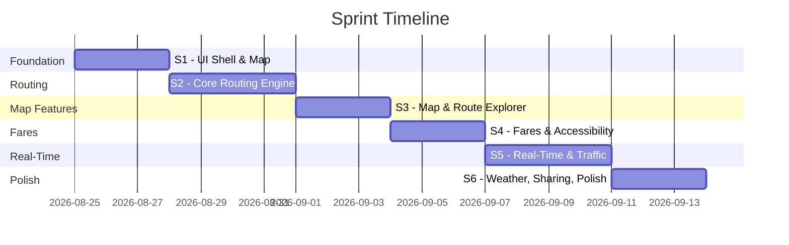
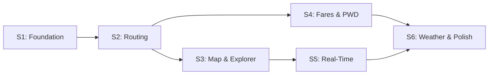

# Sprint Plan: Metro Manila Transit Route Planner

## Token Budget Strategy

> [!IMPORTANT]
> Each sprint is scoped to be **completable within a single conversation session** (~200k token context window). To maximize output per session:
> - Start each sprint session with: *"Execute Sprint N of the transit planner"*
> - Don't re-explain context — point to this document and the PRD
> - Avoid back-and-forth mid-sprint; approve the plan upfront, let it run
> - If a sprint runs hot on tokens, it has a **cut line** — items below the cut line move to next sprint

**Estimated total**: 6 sprints × 1 session each = **6 conversation sessions** to build the full app.

---

## Sprint Overview

| Sprint | Theme | Features (PRD §) | Est. Effort |
|---|---|---|---|
| **S1** | Foundation & UI Shell | Project setup, design system, input form, map | 1 session |
| **S2** | Core Routing Engine | OTP integration, step-by-step results, multi-route, reverse trip (4.1–4.3, 4.12) | 1 session |
| **S3** | Map & Route Explorer | Interactive map polylines, area routes explorer (4.4, 4.5) | 1 session |
| **S4** | Fares & Accessibility | Fare calculator, PWD mode, passenger types (4.8, 4.9) | 1 session |
| **S5** | Real-Time & Traffic | Live vehicle tracking, traffic-aware ETAs (4.6, 4.7) | 1 session |
| **S6** | Weather, Sharing & Polish | Weather/flood warnings, shareable links, QR codes, final polish (4.10, 4.11) | 1 session |

---

## Sprint 1: Foundation & UI Shell

**Goal**: Deliver a visually stunning, responsive app shell with working map and input form — no routing logic yet.

### Scope

| Task | Details |
|---|---|
| Project scaffolding | HTML + CSS + JS structure, folder layout |
| Design system | Color palette, typography (Google Fonts), CSS variables, dark theme |
| Search form | Origin + destination inputs with placeholder autocomplete UI |
| Map integration | Leaflet.js + OpenStreetMap tiles, centered on Metro Manila |
| Responsive layout | Mobile-first, works on 360px–1920px |
| Reverse trip button | 🔄 swap button between inputs (UI only, wired in S2) |

### Acceptance Rubrics

| # | Criterion | Pass | Fail |
|---|---|---|---|
| 1.1 | **App loads** | Page renders in < 2s with no console errors | Blank page, JS errors, or missing assets |
| 1.2 | **Map visible** | Leaflet map renders centered on Metro Manila (14.5995, 120.9842) with zoom level 12+ | Map missing, wrong location, or tiles not loading |
| 1.3 | **Input form** | Two text inputs (From/To) + Find Route button visible and styled | Inputs missing, unstyled, or overlapping map |
| 1.4 | **Responsive** | Layout readable on 360px mobile viewport — no horizontal scroll | Broken layout, overlapping elements, or horizontal scroll |
| 1.5 | **Design quality** | Uses custom font, dark/gradient theme, hover effects, smooth transitions | Default browser font, plain white background, no animations |
| 1.6 | **Reverse button** | 🔄 button visible between inputs, swaps text values on click | Button missing or non-functional |
| 1.7 | **Semantic HTML** | Proper `<h1>`, `<main>`, `<form>`, `<label>` elements; unique IDs | Div soup, missing labels, duplicate IDs |

### Cut Line
If token-constrained: defer autocomplete dropdown styling to S2.

---

## Sprint 2: Core Routing Engine

**Goal**: User types origin + destination → gets step-by-step transit directions with multiple route options.

### Scope

| Task | Details |
|---|---|
| Geocoding | Nominatim API integration — address text → lat/lng |
| Autocomplete | Debounced search-as-you-type with dropdown results |
| OTP routing | Query OpenTripPlanner `/plan` endpoint with origin/destination coords |
| Results UI | Step-by-step leg list with mode icons, stop names, durations |
| Multiple routes | Display 2–3 alternatives ranked by time/transfers |
| Reverse trip | Wire 🔄 button to swap coords + re-trigger search |
| Error handling | "No route found", network errors, invalid input states |

### Acceptance Rubrics

| # | Criterion | Pass | Fail |
|---|---|---|---|
| 2.1 | **Geocoding works** | Typing "Makati" shows matching locations in dropdown | No results, wrong locations, or dropdown doesn't appear |
| 2.2 | **Route returned** | Submitting valid origin + destination returns at least 1 route | Spinner forever, no results, or JS error |
| 2.3 | **Step-by-step legs** | Each route shows ordered legs: mode icon, board/alight stops, duration | Missing legs, wrong order, or no mode differentiation |
| 2.4 | **Multiple routes** | 2–3 alternatives shown with total time + transfer count | Only 1 route ever shown |
| 2.5 | **Reverse trip** | Clicking 🔄 swaps origin/destination and auto-searches | Doesn't swap, doesn't re-search, or loses geocoded coords |
| 2.6 | **Error states** | Invalid input → clear message; API down → graceful fallback | Silent failure, cryptic error, or app crashes |
| 2.7 | **Loading state** | Spinner or skeleton shown while fetching routes | No feedback during load — user thinks app is frozen |

### Cut Line
If token-constrained: defer autocomplete dropdown to basic text input with geocode-on-submit.

### Dependencies
- Requires a running OTP instance with Metro Manila GTFS data, OR a mock API for development

> [!WARNING]
> **OTP setup is the biggest blocker.** If no Metro Manila GTFS data is available, Sprint 2 should use a **mock API** that returns realistic hardcoded route data. Real OTP integration can be swapped in later without changing the frontend.

---

## Sprint 3: Map & Route Explorer

**Goal**: Route results draw on the map. Users can explore all transit routes by mode.

### Scope

| Task | Details |
|---|---|
| Route polylines | Draw colored polylines on Leaflet map for each leg of selected route |
| Markers | Origin (green), destination (red), transfer points (blue) with popups |
| Map fit | Auto-zoom/pan to fit entire route |
| Area routes explorer | Toggle panel with mode filter checkboxes |
| Mode overlays | Load and display all routes per mode from GTFS shapes data |
| Route click interaction | Click a route on map → sidebar popup with route name, stops, schedule |
| Legend | Color key for active modes |

### Acceptance Rubrics

| # | Criterion | Pass | Fail |
|---|---|---|---|
| 3.1 | **Route on map** | After search, colored polyline draws the route with distinct colors per leg (walk = dashed gray, bus = blue, train = red, etc.) | No polyline, wrong path, or single color for all legs |
| 3.2 | **Markers** | Origin, destination, and transfer markers visible with popups showing stop names | Markers missing or in wrong positions |
| 3.3 | **Auto-fit** | Map auto-zooms to fit entire route after search | Route extends beyond visible map area |
| 3.4 | **Explorer toggle** | "Explore Routes" button/panel opens with mode checkboxes | Panel missing or non-functional |
| 3.5 | **Mode filter** | Checking "Bus" shows all bus route polylines; unchecking hides them | Filter doesn't work, shows wrong modes, or crashes with large dataset |
| 3.6 | **Route click** | Clicking a route line on map shows popup/sidebar with route details | No interaction on click |
| 3.7 | **Performance** | Map remains responsive with 50+ routes displayed | Map freezes, lags, or crashes |

### Cut Line
If token-constrained: defer route click interaction (3.6) and legend to S6 polish.

---

## Sprint 4: Fares & Accessibility

**Goal**: Fare breakdown per route with discount support. PWD mode toggle affects routing + fares.

### Scope

| Task | Details |
|---|---|
| Fare calculator | Per-leg fare computation: mode, distance, base fare, discount, final |
| Passenger type | Dropdown: Regular, Student, Senior, PWD — applies 20% discount |
| Fare data | Fare tables for MRT/LRT, bus, jeepney, tricycle (hardcoded or GTFS) |
| Total fare | Sum across all legs, displayed prominently |
| PWD mode toggle | Global switch in header |
| Accessible routing | PWD ON → filter to wheelchair-accessible stops, flag stairs/barriers |
| Accessibility data | Per-stop: wheelchair accessible, elevator, ramp, known barriers |
| Payment method notes | "Beep card" / "Cash only" per leg |

### Acceptance Rubrics

| # | Criterion | Pass | Fail |
|---|---|---|---|
| 4.1 | **Fare shown** | Each route result shows total fare prominently | No fare displayed |
| 4.2 | **Per-leg breakdown** | Expandable section shows fare per leg: mode, route, base fare, discount, final | Only total shown, no breakdown |
| 4.3 | **Passenger type** | Selecting "Student" applies 20% discount to all legs; total recalculates | Discount not applied, wrong percentage, or total doesn't update |
| 4.4 | **PWD auto-link** | Toggling PWD mode ON auto-selects "PWD" passenger type in fare calculator | PWD mode and fare calculator are independent |
| 4.5 | **Accessible routing** | PWD mode ON → route avoids non-accessible stops (if data available) | Same routes shown regardless of PWD toggle |
| 4.6 | **Accessibility icons** | Stops show ♿/🛗/⚠️ icons with tooltip details | No accessibility info visible |
| 4.7 | **Fare accuracy** | MRT-3 fare Quezon Ave → Ayala = ₱28 (base) / ₱22.40 (discounted) | Wrong fare values |

### Cut Line
If token-constrained: defer payment method notes and accessibility icons to S6.

---

## Sprint 5: Real-Time & Traffic

**Goal**: Live vehicle positions on map. ETAs adjusted for traffic conditions.

### Scope

| Task | Details |
|---|---|
| GTFS-RT integration | Fetch VehiclePositions, TripUpdates, ServiceAlerts |
| Live markers | Animated vehicle icons on map, refresh every 15–30s |
| Predicted arrivals | "Bus 22 is 3 stops away (~7 min)" in results |
| Status badges | On-time (green), delayed (yellow), significantly delayed (red) |
| Traffic multipliers | Time-of-day factors for known corridors (EDSA, C5, Commonwealth) |
| Traffic indicator | 🟢/🟡/🔴 per road-based leg |
| Fallback | "Schedule only" badge for operators without GTFS-RT |

### Acceptance Rubrics

| # | Criterion | Pass | Fail |
|---|---|---|---|
| 5.1 | **Live markers** | Vehicle icons appear on map and move on refresh | No vehicle markers, or static (never update) |
| 5.2 | **Refresh cycle** | Positions update every 15–30s without full page reload | Manual refresh needed, or updates cause flicker/jank |
| 5.3 | **Predicted arrival** | Route results show "Bus X is N stops away" when real-time data available | Only schedule times shown despite real-time data existing |
| 5.4 | **Delay badges** | Delayed vehicles show yellow/red status indicator | All vehicles show green regardless of delay |
| 5.5 | **Traffic ETA** | Route at 8AM EDSA shows longer ETA than same route at 11AM | Same ETA regardless of time of day |
| 5.6 | **Traffic indicator** | Road-based legs show 🟢/🟡/🔴 traffic badge | No traffic info on legs |
| 5.7 | **Graceful fallback** | Operators without GTFS-RT show "Schedule only" badge; app doesn't break | App errors or shows fake real-time data |

### Cut Line
If token-constrained: defer ServiceAlerts parsing to S6. Use mock GTFS-RT data if no real feed available.

> [!NOTE]
> **Mock data strategy**: If Metro Manila GTFS-RT feeds are unavailable at dev time, build the full UI with simulated vehicle positions. The data layer can be swapped to real feeds later without frontend changes.

---

## Sprint 6: Weather, Sharing & Final Polish

**Goal**: Weather warnings, shareable links, and full app polish pass.

### Scope

| Task | Details |
|---|---|
| PAGASA integration | Fetch weather advisories, typhoon warnings, rainfall data |
| Flood hotspot database | Known flood-prone areas mapped as GeoJSON |
| Route warnings | ⛈️/🌊/🚫 banners on affected route legs |
| Map weather overlay | Highlight flood-risk zones |
| Share button | Per-route share with URL encoding origin/destination/route |
| Web Share API | Native share sheet on mobile (Messenger, Viber, SMS) |
| Copy to clipboard | One-tap copy of share link |
| QR code | Optional QR generation for share link |
| Polish pass | Animation refinements, loading skeletons, edge cases, performance audit |
| SEO & meta tags | Title, description, Open Graph tags for shared links |

### Acceptance Rubrics

| # | Criterion | Pass | Fail |
|---|---|---|---|
| 6.1 | **Weather banner** | When PAGASA has active warning, banner shows at top of route results | No weather info despite active advisory |
| 6.2 | **Flood warning** | Route passing through known flood zone shows 🌊 warning on that leg | No flood awareness on affected legs |
| 6.3 | **Map overlay** | Flood-risk zones highlighted on map during active weather events | No visual indication on map |
| 6.4 | **Share button** | Each route has a share button that generates a working URL | Button missing or generates broken URL |
| 6.5 | **Shared link opens** | Opening a shared URL auto-fills origin/destination and shows route | Link opens blank page or doesn't populate fields |
| 6.6 | **Mobile share** | On mobile, share triggers native share sheet | Desktop-only share, or share sheet doesn't open |
| 6.7 | **QR code** | QR code generates and is scannable → opens correct route | QR missing, unscannable, or wrong URL |
| 6.8 | **Performance** | Full app loads in < 3s on 4G connection; no jank during interactions | Slow load, visible jank, or memory leaks |
| 6.9 | **No console errors** | Zero unhandled errors in browser console during normal usage | Console errors on common flows |
| 6.10 | **Cross-browser** | Works on Chrome, Firefox, Safari, Edge (latest 2 versions) | Broken on any supported browser |

### Cut Line
If token-constrained: defer QR code generation. Ship share link without QR.

---

## Sprint Dependency Graph

> [!NOTE]
> **S3 and S4 can run in parallel** if working with a collaborator — they share no code dependencies. S5 and S6 must wait for their predecessors.

---

## Session Management Tips

| Tip | Why |
|---|---|
| **Start each session with** "Execute Sprint N of the transit planner — see PRD and sprint plan" | Minimizes tokens spent re-explaining context |
| **Don't review PRD mid-sprint** | I already have it. Just say "Sprint 2, go." |
| **Approve the plan upfront** | Back-and-forth eats tokens. Review rubrics before starting, not during. |
| **Use /goal for complex sprints** | S2 and S5 are the heaviest — `/goal` mode ensures I don't stop early |
| **One sprint per session** | Don't combine sprints. Fresh context = better output. |
| **Save chat if hitting limits** | If tokens run low mid-sprint, say "save progress" — I'll document where I stopped so next session can resume |
